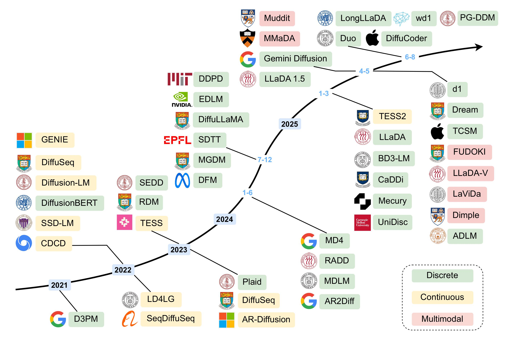

# Awesome Diffusion Language Models 
[](https://awesome.re)

[](https://arxiv.org/abs/2508.10875)

One of the most starred, comprehensive and up-to-date collections of Diffusion Language Model papers, code and resources! If you find this repository helpful, please consider giving it a ⭐ to support.

## Timeline of Diffusion Language Models

This figure highlights key milestones in the development of DLMs, categorized into three groups: continuous DLMs, discrete DLMs, and recent multimodal DLMs.  We observe that while early research predominantly focused on continuous DLMs, discrete DLMs have gained increasing popularity in more recent years. 



## Table of Contents
- [🎮 Playground](#playground)
- [🔥 Must-Read](#must-read)
- [📜 Surveys](#surveys)
- [🧱 Diffusion Foundation](#diffusion-foundation)
- [🎲 Discrete DLMs](#discrete-dlms)   
- [🌊 Continuous DLMs](#continuous-dlms)
- [🖼️ Multimodal DLMs](#multimodal-dlms)
- [🎯 Training Strategies](#training-strategies)
- [🚀 Inference Optimization](#inference-optimization)
- [🔨 Training Frameworks](#training-frameworks)
- [💡 Applications](#applications)
- [🔗 Resources](#resources)


## Playground
- [Seed Diffusion](https://studio.seed.ai/exp/seed_diffusion/) [](https://studio.seed.ai/exp/seed_diffusion/)

- [Mercury](https://chat.inceptionlabs.ai/) [](https://chat.inceptionlabs.ai/)

- [LLaDA](https://huggingface.co/spaces/multimodalart/LLaDA) [](https://huggingface.co/spaces/multimodalart/LLaDA)

- [MMaDA](https://huggingface.co/spaces/Gen-Verse/MMaDA) [](https://huggingface.co/spaces/Gen-Verse/MMaDA)

- [Dream](https://huggingface.co/spaces/multimodalart/Dream) [](https://huggingface.co/spaces/multimodalart/Dream)

## Must-Read
D3PM: [Structured Denoising Diffusion Models in Discrete State-Spaces](https://arxiv.org/abs/2107.03006)  
[](https://arxiv.org/abs/2107.03006)  

LLaDA: [Large Language Diffusion Models](https://arxiv.org/abs/2502.09992)  
[](https://arxiv.org/abs/2502.09992)
[](https://ml-gsai.github.io/LLaDA-demo/)
[](https://github.com/ML-GSAI/LLaDA)

[Block Diffusion: Interpolating Between Autoregressive and Diffusion Language Models](https://arxiv.org/abs/2503.09573) (ICLR 2025)  
[](https://arxiv.org/abs/2503.09573) 
[](https://github.com/kuleshov-group/bd3lms)

[Fast-dLLM: Training-free Acceleration of Diffusion LLM by Enabling KV Cache and Parallel Decoding](https://arxiv.org/abs/2505.22618)  
[](https://arxiv.org/abs/2505.22618)
[](https://nvlabs.github.io/Fast-dLLM/)
[](https://github.com/NVlabs/Fast-dLLM)

Super Data Learners: [Diffusion Language Models are Super Data Learners](https://arxiv.org/abs/2511.03276)  
[](https://arxiv.org/abs/2511.03276)
[](https://github.com/JinjieNi/dlms-are-super-data-learners)
[](https://github.com/JinjieNi/dlms-are-super-data-learners)


## Surveys
[12 Aug 2025] [A Survey on Parallel Text Generation: From Parallel Decoding to Diffusion Language Models](https://arxiv.org/abs/2508.08712v2)  
[](https://arxiv.org/abs/2508.08712v2)
[](https://github.com/zhanglingzhe0820/Awesome-Parallel-Text-Generation)

[16 Jun 2025] [Discrete Diffusion in Large Language and Multimodal Models: A Survey](https://arxiv.org/abs/2506.13759)  
[](https://arxiv.org/abs/2506.13759)
[](https://github.com/LiQiiiii/DLLM-Survey)

[23 Feb 2024] [Diffusion models in text generation: a survey](https://peerj.com/articles/cs-1905/) (PeerJ Computer Science)  

[29 Jun 2023] [An Overview of Diffusion Models for Text Generation](https://ieeexplore.ieee.org/document/10159911) (MIPRO)  

[24 May 2023] [A Survey of Diffusion Models in Natural Language Processing](https://arxiv.org/abs/2305.14671)  
[](https://arxiv.org/abs/2305.14671)

[14 Mar 2023] [Diffusion Models in NLP: A Survey](https://arxiv.org/abs/2303.07576)  
[](https://arxiv.org/abs/2303.07576)

[12 Mar 2023] [Diffusion Models for Non-autoregressive Text Generation: A Survey](https://arxiv.org/abs/2303.06574) (IJCAI 2023)  
[](https://arxiv.org/abs/2303.06574)
[](https://github.com/RUCAIBox/Awesome-Text-Diffusion-Models)

## Diffusion Foundation

[7 Sep 2022] [Flow Straight and Fast: Learning to Generate and Transfer Data with Rectified Flow](https://arxiv.org/abs/2209.03003)   (ICLR 2023)  
[](https://arxiv.org/abs/2209.03003)
[](https://github.com/gnobitab/RectifiedFlow)

[26 Nov 2020] [Score-Based Generative Modeling through Stochastic Differential Equations](https://arxiv.org/abs/2011.13456) (ICLR 2021)  
[](https://arxiv.org/abs/2011.13456)
[](https://github.com/yang-song/score_sde)

[6 Oct 2020] [Denoising Diffusion Implicit Models](https://arxiv.org/abs/2010.02502) (ICLR 2021)  
[](https://arxiv.org/abs/2010.02502)
[](https://github.com/ermongroup/ddim)

[19 Jun 2020] [Denoising Diffusion Probabilistic Models](https://arxiv.org/abs/2006.11239) (NeurIPS 2020)  
[](https://arxiv.org/abs/2006.11239)
[](https://hojonathanho.github.io/diffusion/)
[](https://github.com/hojonathanho/diffusion)

[12 Jul 2019] [Generative Modeling by Estimating Gradients of the Data Distribution](https://arxiv.org/abs/1907.05600) (NeurIPS 2019)  
[](https://arxiv.org/abs/1907.05600)
[](https://github.com/ermongroup/ncsn)

[12 Mar 2015] [Deep Unsupervised Learning using Nonequilibrium Thermodynamics](https://arxiv.org/abs/1503.03585) (ICML 2015)  
[](https://arxiv.org/abs/1503.03585)
[](https://github.com/Sohl-Dickstein/Diffusion-Probabilistic-Models)


## Discrete DLMs
[12 Nov 2025] [TiDAR: Think in Diffusion, Talk in Autoregression](https://arxiv.org/abs/2511.08923v1)<br>
[](https://arxiv.org/abs/2511.08923v1)


[05 Nov 2025] [Training Optimal Large Diffusion Language Models](https://arxiv.org/abs/2510.03280)  
[](https://arxiv.org/abs/2510.03280)
[](https://github.com/JinjieNi/Quokka)
[](https://github.com/JinjieNi/MegaDLMs)

[02 Nov 2025] [OpenMoE 2: Sparse Diffusion Language Models](https://jinjieni.notion.site/OpenMoE-2-Sparse-Diffusion-Language-Models-277d8f03a8668065a4ecd23f23bd6aac?source=copy_link)  
[](https://jinjieni.notion.site/OpenMoE-2-Sparse-Diffusion-Language-Models-277d8f03a8668065a4ecd23f23bd6aac?source=copy_link)
[](https://github.com/JinjieNi/OpenMoE2)
[](https://github.com/JinjieNi/MegaDLMs)

[1 Nov 2025] [SpecDiff-2: Scaling Diffusion Drafter Alignment For Faster Speculative Decoding](https://arxiv.org/abs/2511.00606v2)<br>
[](https://arxiv.org/abs/2511.00606v2)

[31 Oct 2025] [Diffuse Thinking: Exploring Diffusion Language Models as Efficient Thought Proposers for Reasoning](https://arxiv.org/abs/2510.27469v1)<br>
[](https://arxiv.org/abs/2510.27469v1)

[30 Oct 2025] [Don't Let It Fade: Preserving Edits in Diffusion Language Models via Token Timestep Allocation](https://arxiv.org/abs/2510.26200v1)
<br>
[](https://arxiv.org/abs/2510.26200v1)


[27 Oct 2025] [Variational Masked Diffusion Models](https://arxiv.org/abs/2510.23606v1)<br>
[](https://arxiv.org/abs/2510.23606v1)
[](https://riccizz.github.io/VMD/)
[](https://github.com/riccizz/VMD)


[21 Oct 2025] [How Efficient Are Diffusion Language Models? A Critical Examination of Efficiency Evaluation Practices](https://arxiv.org/abs/2510.18480v1)<br>
[](https://arxiv.org/abs/2510.18480v1)

[20 Oct 2025] [Soft-Masked Diffusion Language Models](https://arxiv.org/abs/2510.17206v1)<br>
[](https://arxiv.org/abs/2510.17206v1)

[17 Oct 2025] [Planner and Executor: Collaboration between Discrete Diffusion And Autoregressive Models in Reasoning](https://arxiv.org/abs/2510.15244v2)<br>
[](https://arxiv.org/abs/2510.15244v2)

[17 Oct 2025] [Attention Sinks in Diffusion Language Models](https://arxiv.org/abs/2510.15731v1)<br>
[](https://arxiv.org/abs/2510.15731v1)


[15 Oct 2025] [On the Reasoning Abilities of Masked Diffusion Language Models](https://arxiv.org/abs/2510.13117v1)<br>
[](https://arxiv.org/abs/2510.13117v1)


[12 Oct 2025] [UltraLLaDA: Scaling the Context Length to 128K for Diffusion Large Language Models](https://arxiv.org/abs/2510.10481v1)
<br>
[](https://arxiv.org/abs/2510.10481v1)
[](https://github.com/Relaxed-System-Lab/UltraLLaDA)


[10 Oct 2025] [Closing the Data-Efficiency Gap Between Autoregressive and Masked Diffusion LLMs](https://arxiv.org/abs/2510.09885v1)<br>
[](https://arxiv.org/abs/2510.09885v1)

[10 Oct 2025] [Beyond Surface Reasoning: Unveiling the True Long Chain-of-Thought Capacity of Diffusion Large Language Models](https://arxiv.org/abs/2510.09544v1)<br>
[](https://arxiv.org/abs/2510.09544v1)


[8 Oct 2025] [Next Semantic Scale Prediction via Hierarchical Diffusion Language Models](https://arxiv.org/abs/2510.08632v1)<br>
[](https://arxiv.org/abs/2510.08632v1)

[7 Oct 2025] [SDAR: A Synergistic Diffusion-AutoRegression Paradigm for Scalable Sequence Generation](https://arxiv.org/abs/2510.06303)<br>
[](https://arxiv.org/abs/2510.06303)
[](https://github.com/JetAstra/SDAR)


[5 Oct 2025] [What Makes Diffusion Language Models Super Data Learners?](https://arxiv.org/abs/2510.04071v1)<br>
[](https://arxiv.org/abs/2510.04071v1)
[](https://github.com/zitian-gao/data-efficiency)

[5 Oct 2025] [Beyond Next-Token Prediction: A Performance Characterization of Diffusion versus Autoregressive Language Models](https://arxiv.org/abs/2510.04146v1)<br>
[](https://arxiv.org/abs/2510.04146v1)

[4 Oct 2025] [Rainbow Padding: Mitigating Early Termination in Instruction-Tuned Diffusion LLMs](https://arxiv.org/abs/2510.03680)<br>
[](https://arxiv.org/abs/2510.03680)
[](https://github.com/quasar529/rainbow-padding)

[3 Oct 2025] [DMark: Order-Agnostic Watermarking for Diffusion Large Language Models](https://www.arxiv.org/abs/2510.02902)<br>
[](https://www.arxiv.org/abs/2510.02902)

[1 Oct 2025] [Continuously Augmented Discrete Diffusion model for Categorical Generative Modeling](https://arxiv.org/abs/2510.01329)
<br>
[](https://arxiv.org/abs/2510.01329)

[30 Sep 2025] [dParallel: Learnable Parallel Decoding for dLLMs](https://arxiv.org/abs/2509.26488)<br>
[](https://arxiv.org/abs/2509.26488)
[](https://github.com/czg1225/dParallel)

[29 Sep 2025] [Why mask diffusion does not work](https://arxiv.org/abs/2510.03289v1)<br>
[](https://arxiv.org/abs/2510.03289v1)

[29 Sep 2025] [DiffuGuard: How Intrinsic Safety is Lost and Found in Diffusion Large Language Models](https://arxiv.org/abs/2509.24296v1)
<br>
[](https://arxiv.org/abs/2509.24296v1)
[](https://github.com/niez233/DiffuGuard)

[29 Sep 2025] [LLaDA-MoE: A Sparse MoE Diffusion Language Model](https://arxiv.org/abs/2509.24389v1)<br>
[](https://arxiv.org/abs/2509.24389v1)


[29 Sep 2025] [Ultra-Fast Language Generation via Discrete Diffusion Divergence Instruct](https://arxiv.org/abs/2509.25035v2)<br>
[](https://arxiv.org/abs/2509.25035v2)

[28 Sep 2025] [SparseD: Sparse Attention for Diffusion Language Models](https://arxiv.org/abs/2509.24014v1)<br>
[](https://arxiv.org/abs/2509.24014v1)
[](https://github.com/INV-WZQ/SparseD)

[28 Sep 2025] [Sequential Diffusion Language Models](https://arxiv.org/abs/2509.24007v1)<br>
[](https://arxiv.org/abs/2509.24007v1)
[](https://github.com/OpenGVLab/SDLM)

[27 Sep 2025] [Tree Reward-Aligned Search for TReASURe in Masked Diffusion Language Models](https://arxiv.org/abs/2509.23146v1)<br>
[](https://arxiv.org/abs/2509.23146v1)

[24 Sep 2025] [FS-DFM: Fast and Accurate Long Text Generation with Few-Step Diffusion Language Models](https://arxiv.org/abs/2509.20624v1)<br>
[](https://arxiv.org/abs/2509.20624v1)

[17 Sep 2025] [Masked Diffusion Models as Energy Minimization](https://arxiv.org/abs/2509.13866v1)<br>
[](https://arxiv.org/abs/2509.13866v1)

[5 Sep 2025] [Masked Diffusion Language Models with Frequency-Informed Training](https://arxiv.org/abs/2509.05056v1)<br>
[](https://arxiv.org/abs/2509.05056v1)

[1 Sep 2025] [Dream-Coder 7B: An Open Diffusion Language Model for Code](https://arxiv.org/abs/2509.01142v1)<br>
[](https://arxiv.org/abs/2509.01142v1)
[](https://hkunlp.github.io/blog/2025/dream-coder/)
[](https://github.com/DreamLM/Dream-Coder)

[31 Aug 2025] [Any-Order Flexible Length Masked Diffusion](https://arxiv.org/abs/2509.01025)<br>
[](https://arxiv.org/abs/2509.01025)

[17 Aug 2025] [Where to Start Alignment? Diffusion Large Language Model May Demand a Distinct Position](https://arxiv.org/abs/2508.12398v1)<br>
[](https://arxiv.org/abs/2508.12398v1)

[14 Aug 2025] [Thinking Inside the Mask: In-Place Prompting in Diffusion LLMs](https://arxiv.org/abs/2508.10736)<br>
[](https://arxiv.org/abs/2508.10736)


[12 Aug 2025] [Time Is a Feature: Exploiting Temporal Dynamics in Diffusion Language Models](https://arxiv.org/abs/2508.09138v1)<br>
[](https://arxiv.org/abs/2508.09138v1)
[](https://aim-uofa.github.io/dLLM-MidTruth/)

[4 Aug 2025] [Seed Diffusion: A Large-Scale Diffusion Language Model with High-Speed Inference](https://arxiv.org/abs/2508.02193v1)<br>
[](https://arxiv.org/abs/2508.02193v1)
[](https://seed.bytedance.com/seed_diffusion)


[25 Jul 2025] [Jailbreaking Large Language Diffusion Models: Revealing Hidden Safety Flaws in Diffusion-Based Text Generation](https://arxiv.org/abs/2507.19227v1)<br>
[](https://arxiv.org/abs/2507.19227v1)

[15 Jul 2025] [DreamOn: Diffusion Language Models For Code Infilling Beyond Fixed-Size Canvas](https://hkunlp.github.io/blog/2025/dreamon/)<br>
[](https://hkunlp.github.io/blog/2025/dreamon/)
[](https://github.com/DreamLM/DreamOn)

[15 Jul 2025] [The Devil behind the mask: An emergent safety vulnerability of Diffusion LLMs](https://arxiv.org/abs/2507.11097v1)<br>
[](https://arxiv.org/abs/2507.11097v1)
[](https://github.com/ZichenWen1/DIJA)

[10 Jul 2025] [Your Absorbing Discrete Diffusion Secretly Models the Bayesian Posterior](https://arxiv.org/abs/2507.07586)<br>
[](https://arxiv.org/abs/2507.07586)
[](https://github.com/mercury0100/bayesradd)

[7 Jul 2025] [Review, Remask, Refine (R3): Process-Guided Block Diffusion for Text Generation](https://arxiv.org/abs/2507.08018v1) (ICML 2025)<br>
[](https://arxiv.org/abs/2507.08018v1)

[6 Jul 2025] [Efficient perplexity bound and ratio matching in discrete diffusion language models](https://arxiv.org/abs/2507.04341) (ICLR 2025)<br>
[](https://arxiv.org/abs/2507.04341)
[](https://github.com/MetaDialog-Research/PBRC)

[2 Jul 2025] [Discrete Diffusion Models for Language Generation](https://arxiv.org/abs/2507.07050)<br>
[](https://arxiv.org/abs/2507.07050)
[](https://github.com/AshenWELI/Discrete-Diffusion-Models-for-Language-Genaration)

[17 Jun 2025] [LongLLaDA: Unlocking Long Context Capabilities in Diffusion LLMs](https://arxiv.org/abs/2506.14429)<br>
[](https://arxiv.org/abs/2506.14429)
[](https://github.com/OpenMOSS/LongLLaDA)

[12 Jun 2025] [The Diffusion Duality](https://arxiv.org/abs/2506.10892) (ICML 2025)<br>
[](https://arxiv.org/abs/2506.10892)
[](https://s-sahoo.com/duo/)
[](https://github.com/s-sahoo/duo)

[12 Jun 2025] [Accelerating Diffusion Large Language Models with SlowFast Sampling: The Three Golden Principles](https://arxiv.org/abs/2506.10848)<br>
[](https://arxiv.org/abs/2506.10848)
[](https://github.com/LiangrunFlora/Slow-Fast-Sampling)

[2 Jun 2025] [Esoteric Language Models](https://arxiv.org/abs/2506.01928)<br>
[](https://arxiv.org/abs/2506.01928)
[](https://s-sahoo.com/Eso-LMs/)
[](https://github.com/s-sahoo/Eso-LMs)

[25 May 2025] [LLaDA 1.5: Variance-Reduced Preference Optimization for Large Language Diffusion Models](https://arxiv.org/abs/2505.19223)<br>
[](https://arxiv.org/abs/2505.19223)
[](https://ml-gsai.github.io/LLaDA-1.5-Demo/)
[](https://github.com/ML-GSAI/LLaDA-1.5)

[24 May 2025] [Anchored Diffusion Language Model](https://arxiv.org/abs/2505.18456)<br>
[](https://arxiv.org/abs/2505.18456)

[21 May 2025] [Diffusion vs. Autoregressive Language Models: A Text Embedding Perspective](https://arxiv.org/abs/2505.15045)<br>
[](https://arxiv.org/abs/2505.15045)

[20 May 2025] [CtrlDiff: Boosting Large Diffusion Language Models with Dynamic Block Prediction and Controllable Generation](https://arxiv.org/abs/2505.14455)<br>
[](https://arxiv.org/abs/2505.14455)

[9 May 2025] [Insertion Language Models: Sequence Generation with Arbitrary-Position Insertions](https://arxiv.org/abs/2505.05755)<br>
[](https://arxiv.org/abs/2505.05755)

[22 Apr 2025] [Target Concrete Score Matching: A Holistic Framework for Discrete Diffusion](https://arxiv.org/abs/2504.16431) (ICML 2025)<br>
[](https://arxiv.org/abs/2504.16431)

[2 Apr 2025] [Dream 7B](https://hkunlp.github.io/blog/2025/dream/)<br>
[](https://hkunlp.github.io/blog/2025/dream/)
[](https://github.com/HKUNLP/Dream)

[16 Mar 2025] [State Fourier Diffusion Language Model (SFDLM): A Scalable, Novel Iterative Approach to Language Modeling](https://arxiv.org/abs/2503.17382)<br>
[](https://arxiv.org/abs/2503.17382)

[12 Mar 2025] [Constrained Discrete Diffusion](https://arxiv.org/abs/2503.09790)<br>
[](https://arxiv.org/abs/2503.09790)

[12 Mar 2025] [Block Diffusion: Interpolating Between Autoregressive and Diffusion Language Models](https://arxiv.org/abs/2503.09573) (ICLR 2025)<br>
[](https://arxiv.org/abs/2503.09573)
[](https://m-arriola.com/bd3lms)
[](https://github.com/kuleshov-group/bd3lms)

[11 Mar 2025] [Understanding the Quality-Diversity Trade-off in Diffusion Language Models](https://arxiv.org/abs/2503.10683)<br>
[](https://arxiv.org/abs/2503.10683)
[](https://github.com/zzbuzzard/guidediffuseq)

[6 Mar 2025] [Generalized Interpolating Discrete Diffusion](https://arxiv.org/abs/2503.04482) (ICML 2025)<br>
[](https://arxiv.org/abs/2503.04482)
[](https://github.com/dvruette/gidd)

[14 Feb 2025] [Large Language Diffusion Models](https://arxiv.org/abs/2502.09992)<br>
[](https://arxiv.org/abs/2502.09992)
[](https://ml-gsai.github.io/LLaDA-demo/)
[](https://github.com/ML-GSAI/LLaDA) 

[13 Feb 2025] [Theoretical Benefit and Limitation of Diffusion Language Model](https://arxiv.org/abs/2502.09622)<br>
[](https://arxiv.org/abs/2502.09622)

[13 Feb 2025] [Non-Markovian Discrete Diffusion with Causal Language Models](https://arxiv.org/abs/2502.09767)<br>
[](https://arxiv.org/abs/2502.09767)

[10 Feb 2025] [Train for the Worst, Plan for the Best: Understanding Token Ordering in Masked Diffusions](https://arxiv.org/abs/2502.06768) (ICML 2025)<br>
[](https://arxiv.org/abs/2502.06768)

[10 Nov 2024] [Conditional [MASK] Discrete Diffusion Language Model](https://arxiv.org/abs/2411.06438v5)<br>
[](https://arxiv.org/abs/2411.06438v5)

[28 Oct 2024] [Beyond Autoregression: Fast LLMs via Self-Distillation Through Time](https://arxiv.org/abs/2410.21035) (ICLR 2025)<br>
[](https://arxiv.org/abs/2410.21035)
[](https://jdeschena.github.io/sdtt-blog/)
[](https://github.com/jdeschena/sdtt)

[28 Oct 2024] [Energy-Based Diffusion Language Models for Text Generation](https://arxiv.org/abs/2410.21357) (ICLR 2025)<br>
[](https://arxiv.org/abs/2410.21357)
[](https://github.com/MinkaiXu/Energy-Diffusion-LLM)

[24 Oct 2024] [Scaling up Masked Diffusion Models on Text](https://arxiv.org/abs/2410.18514) (ICLR 2025)<br>
[](https://arxiv.org/abs/2410.18514)
[](https://github.com/ml-gsai/smdm)

[23 Oct 2024] [Scaling Diffusion Language Models via Adaptation from Autoregressive Models](https://arxiv.org/abs/2410.17891) (ICLR 2025)<br>
[](https://arxiv.org/abs/2410.17891)
[](https://github.com/hkunlp/diffullama)

[18 Oct 2024] [Beyond Autoregression: Discrete Diffusion for Complex Reasoning and Planning](https://arxiv.org/abs/2410.14157) (ICLR 2025)<br>
[](https://arxiv.org/abs/2410.14157)
[](https://github.com/HKUNLP/diffusion-vs-ar)

[8 Oct 2024] (DDPD) [Think While You Generate: Discrete Diffusion with Planned Denoising](https://arxiv.org/abs/2410.06264) (ICLR 2025)<br>
[](https://arxiv.org/abs/2410.06264)
[](https://github.com/liusulin/DDPD)

[2 Oct 2024] [Discrete Copula Diffusion](https://arxiv.org/abs/2410.01949) (ICLR 2025)<br>
[](https://arxiv.org/abs/2410.01949)
[](https://github.com/liuanji/Copula-Diffusion)

[4 Sep 2024] [Masked Diffusion Models are Secretly Time-Agnostic Masked Models and Exploit Inaccurate Categorical Sampling](https://arxiv.org/abs/2409.02908) (ICLR 2025)<br>
[](https://arxiv.org/abs/2409.02908)

[22 Jul 2024] [Discrete Flow Matching](https://arxiv.org/abs/2407.15595) (NeurIPS 2024)<br>
[](https://arxiv.org/abs/2407.15595)

[10 Jul 2024] [Promises, Outlooks and Challenges of Diffusion Language Modeling](https://arxiv.org/abs/2406.11473)<br>
[](https://arxiv.org/abs/2406.11473)

[11 Jun 2024] (MDLM) [Simple and Effective Masked Diffusion Language Models](https://arxiv.org/abs/2406.07524) (NeurIPS 2024)<br>
[](https://arxiv.org/abs/2406.07524)
[](https://s-sahoo.com/mdlm/)
[](https://github.com/kuleshov-group/mdlm)

[6 Jun 2024] (RADD) [Your Absorbing Discrete Diffusion Secretly Models the Conditional Distributions of Clean Data](https://arxiv.org/abs/2406.03736) (ICLR 2025)<br>
[](https://arxiv.org/abs/2406.03736)

[6 Jun 2024] (MD4) [Simplified and Generalized Masked Diffusion for Discrete Data](https://arxiv.org/abs/2406.04329) (NeurIPS 2024)<br>
[](https://arxiv.org/abs/2406.04329)
[](https://github.com/google-deepmind/md4)

[7 Feb 2024] [Generative Flows on Discrete State-Spaces: Enabling Multimodal Flows with Applications to Protein Co-Design](https://arxiv.org/abs/2402.04997) (ICML 2024)<br>
[](https://arxiv.org/abs/2402.04997)

[30 Jan 2024] [Transfer Learning for Text Diffusion Models](https://arxiv.org/abs/2401.17181)<br>
[](https://arxiv.org/abs/2401.17181)

[25 Oct 2023] (SEDD) [Discrete Diffusion Modeling by Estimating the Ratios of the Data Distribution](https://arxiv.org/abs/2310.16834) (ICML 2024)<br>
[](https://arxiv.org/abs/2310.16834)
[](https://github.com/louaaron/Score-Entropy-Discrete-Diffusion)

[15 Oct 2023] [FiLM: Fill-in Language Models for Any-Order Generation](https://arxiv.org/abs/2310.09930)<br>
[](https://arxiv.org/abs/2310.09930)
[](https://github.com/shentianxiao/FiLM)

[23 Aug 2023] [Diffusion Language Models Can Perform Many Tasks with Scaling and Instruction-Finetuning](https://arxiv.org/abs/2308.12219)<br>
[](https://arxiv.org/abs/2308.12219)
[](https://github.com/yegcjs/diffusionllm)

[30 May 2023] [Likelihood-Based Diffusion Language Models](https://arxiv.org/abs/2305.18619) (NeurIPS 2023)<br>
[](https://arxiv.org/abs/2305.18619)
[](https://github.com/igul222/plaid)

[6 May 2023] [Diffusion-NAT: Self-Prompting Discrete Diffusion for Non-Autoregressive Text Generation](https://arxiv.org/abs/2305.04044) (EACL 2024)<br>
[](https://arxiv.org/abs/2305.04044) [](https://github.com/Lancelot39/DiffusionNAT)

[11 Feb 2023] [A Reparameterized Discrete Diffusion Model for Text Generation](https://arxiv.org/abs/2302.05737) (COLM 2024)<br>
[](https://arxiv.org/abs/2302.05737)
[](https://github.com/HKUNLP/reparam-discrete-diffusion)

[28 Nov 2022] [DiffusionBERT: Improving Generative Masked Language Models with Diffusion Models](https://arxiv.org/abs/2211.15029) (ACL 2023)<br>
[](https://arxiv.org/abs/2211.15029)
[](https://github.com/Hzfinfdu/Diffusion-BERT)


[30 Oct 2022] [DiffusER: Discrete Diffusion via Edit-based Reconstruction](https://arxiv.org/abs/2210.16886) (ICLR 2023)<br>
[](https://arxiv.org/abs/2210.16886)


[13 Dec 2021] (SUNDAE) [Step-unrolled Denoising Autoencoders for Text Generation](https://arxiv.org/abs/2112.06749) (ICLR 2022)<br>
[](https://arxiv.org/abs/2112.06749)

[7 Jul 2021] [Structured Denoising Diffusion Models in Discrete State-Spaces](https://arxiv.org/abs/2107.03006) (NeurIPS 2021)<br>
[](https://arxiv.org/abs/2107.03006)

[10 Feb 2021] [Argmax Flows and Multinomial Diffusion: Learning Categorical Distributions](https://arxiv.org/abs/2102.05379) (NeurIPS 2021)<br>
[](https://arxiv.org/abs/2102.05379)
[](https://github.com/didriknielsen/argmax_flows)


## Continuous DLMs
[26 Oct 2025] [CANDI: Hybrid Discrete-Continuous Diffusion Models](https://arxiv.org/abs/2510.22510)<br>
[](https://arxiv.org/abs/2510.22510)
[](https://patrickpynadath1.github.io/candi-lander/)
[](https://github.com/patrickpynadath1/candi-diffusion)

[6 Oct 2025] [LaDiR: Latent Diffusion Enhances LLMs for Text Reasoning](https://arxiv.org/abs/2510.04573v2)<br>
[](https://arxiv.org/abs/2510.04573v2)


[3 Oct 2025] [Coevolutionary Continuous Discrete Diffusion: Make Your Diffusion Language Model a Latent Reasoner](https://www.arxiv.org/abs/2510.03206)<br>
[](https://www.arxiv.org/abs/2510.03206)

[26 Jun 2025] [Compressed and Smooth Latent Space for Text Diffusion Modeling](https://arxiv.org/abs/2506.21170)<br>
[](https://arxiv.org/abs/2506.21170)

[28 May 2025] [Unifying Continuous and Discrete Text Diffusion with Non-simultaneous Diffusion Processes](https://arxiv.org/abs/2505.22165) (ACL 2025)<br>
[](https://arxiv.org/abs/2505.22165)

[24 May 2025] [Smoothie: Smoothing Diffusion on Token Embeddings for Text Generation](https://arxiv.org/abs/2505.18853)<br>
[](https://arxiv.org/abs/2505.18853)
[](https://github.com/ashaba1in/smoothie)

[20 Apr 2025] [Perfect diffusion is TC^0 -- Bad diffusion is Turing-complete](https://arxiv.org/abs/2507.12469)<br>
[](https://arxiv.org/abs/2507.12469)

[19 Feb 2025] [TESS 2: A Large-Scale Generalist Diffusion Language Model](https://arxiv.org/abs/2502.13917)<br>
[](https://arxiv.org/abs/2502.13917)
[](https://github.com/hamishivi/tess-2)

[15 Dec 2024] [Segment-Level Diffusion: A Framework for Controllable Long-Form Generation with Diffusion Language Models](https://arxiv.org/abs/2412.11333) (ACL 2025)<br>
[](https://arxiv.org/abs/2412.11333)

[17 Oct 2024] [Meta-DiffuB: A Contextualized Sequence-to-Sequence Text Diffusion Model with Meta-Exploration](https://arxiv.org/abs/2410.13201) (NeurIPS 2024)<br>
[](https://arxiv.org/abs/2410.13201)
[](https://github.com/meta-diffub/meta-diffub)

[8 Aug 2024] [Diffusion Guided Language Modeling](https://arxiv.org/abs/2408.04220) (ACL Findings 2024)<br>
[](https://arxiv.org/abs/2408.04220)
[](https://github.com/justinlovelace/diffusion-guided-lm) 

[May 2024] [Effective Integration of Text Diffusion and Pre-Trained Language Models with Linguistic Easy-First Schedule](https://aclanthology.org/2024.lrec-main.493/) (LREC-COLING 2024)

[17 Mar 2024] [Language Rectified Flow: Advancing Diffusion Language Generation with Probabilistic Flows](https://arxiv.org/abs/2403.16995) (NAACL 2024)<br>
[](https://arxiv.org/abs/2403.16995)

[14 Mar 2024] [LDSeq: Latent Diffusion Models for Sequence to Sequence Text Generation](https://dl.acm.org/doi/10.1145/3638584.3638617) (CSAI 23)

[Mar 2024] [Flow Matching for Conditional Text Generation in a Few Sampling Steps](https://aclanthology.org/2024.eacl-short.33/) (EACL 2024)  

[29 Feb 2024] [TEncDM: Understanding the Properties of Diffusion Model in the Space of Language Model Encodings](https://arxiv.org/abs/2402.19097)<br>
[](https://arxiv.org/abs/2402.19097)
[](https://github.com/M0RJIQUE/tencdm)

[29 Feb 2024] [Generating, Reconstructing, and Representing Discrete and Continuous Data: Generalized Diffusion with Learnable Encoding-Decoding](https://arxiv.org/abs/2402.19009) (ICML 2024)<br>
[](https://arxiv.org/abs/2402.19009)

[31 Oct 2023] [LADIDA: Latent Diffusion for Document Generation with Sequential Decoding](https://neurips.cc/virtual/2023/74876) (NeurIPS Workshop 2023)  

[18 Oct 2023] [InfoDiffusion: Information Entropy Aware Diffusion Process for Non-Autoregressive Text Generation](https://arxiv.org/abs/2310.11976) (EMNLP 2023)<br>
[](https://arxiv.org/abs/2310.11976)
[](https://github.com/rzhwang/infodiffusion)

[09 Oct 2023] [DiffuSeq-v2: Bridging Discrete and Continuous Text Spaces for Accelerated Seq2Seq Diffusion Models](https://arxiv.org/abs/2310.05793) (EMNLP 2023)<br>
[](https://arxiv.org/abs/2310.05793)
[](https://github.com/Shark-NLP/DiffuSeq)

[26 Jul 2023] [How Does Diffusion Influence Pretrained Language Models on Out-of-Distribution Data?](https://arxiv.org/abs/2307.13949) (ECAI 2023)<br>
[](https://arxiv.org/abs/2307.13949)
[](https://github.com/maybelizzy/diffusion_ood_robustness)

[19 May 2023] [DiffuSIA: A Spiral Interaction Architecture for Encoder-Decoder Text Diffusion](https://arxiv.org/abs/2305.11517)<br>
[](https://arxiv.org/abs/2305.11517)

[16 May 2023] [AR-Diffusion: Auto-Regressive Diffusion Model for Text Generation](https://arxiv.org/abs/2305.09515) (NeurIPS 2023)<br>
[](https://arxiv.org/abs/2305.09515)
[](https://github.com/microsoft/ProphetNet/tree/master/AR-diffusion)

[15 May 2023] [TESS: Text-to-Text Self-Conditioned Simplex Diffusion](https://arxiv.org/abs/2305.08379) (EACL 2024)<br>
[](https://arxiv.org/abs/2305.08379)
[](https://github.com/allenai/tess-diffusion)

[25 Apr 2023] [Glyphdiffusion: Text generation as image generation](https://arxiv.org/abs/2304.12519)<br>
[](https://arxiv.org/abs/2304.12519)

[10 Apr 2023] [A Cheaper and Better Diffusion Language Model with Soft-Masked Noise](https://arxiv.org/abs/2304.04746) (EMNLP 2023)<br>
[](https://arxiv.org/abs/2304.04746)
[](https://github.com/amazon-science/masked-diffusion-lm)

[20 Feb 2023] [Dinoiser: Diffused conditional sequence learning by manipulating noises](https://arxiv.org/abs/2302.10025) (TCAL 2024)<br>
[](https://arxiv.org/abs/2302.10025)
[](https://github.com/yegcjs/DINOISER)

[22 Dec 2022] (GENIE) [Text Generation with Diffusion Language Models: A Pre-training Approach with Continuous Paragraph Denoise](https://arxiv.org/abs/2212.11685) (ICML 2023)<br>
[](https://arxiv.org/abs/2212.11685)
[](https://github.com/microsoft/ProphetNet/tree/master/GENIE)

[20 Dec 2022] [Seqdiffuseq: Text diffusion with encoder-decoder transformers](https://arxiv.org/abs/2212.10325) (NAACL 2024)<br>
[](https://arxiv.org/abs/2212.10325)[](https://github.com/Yuanhy1997/SeqDiffuSeq)

[19 Dec 2022] [Latent Diffusion for Language Generation](https://arxiv.org/abs/2212.09462) (NeurIPS 2023)<br>
[](https://arxiv.org/abs/2212.09462)
[](https://github.com/justinlovelace/latent-diffusion-for-language)

[19 Dec 2022] (Difformer) [Empowering Diffusion Models on the Embedding Space for Text Generation](https://arxiv.org/abs/2212.09412) (NAACL 2024)<br>
[](https://arxiv.org/abs/2212.09412)
[](https://github.com/zhjgao/difformer)

[28 Nov 2022] [Continuous diffusion for categorical data](https://arxiv.org/abs/2211.15089)<br>
[](https://arxiv.org/abs/2211.15089)

[8 Nov 2022] [Self-conditioned Embedding Diffusion for Text Generation](https://arxiv.org/abs/2211.04236)<br>
[](https://arxiv.org/abs/2211.04236)

[31 Oct 2022] [SSD-LM: Semi-autoregressive Simplex-based Diffusion Language Model for Text Generation and Modular Control](https://arxiv.org/abs/2210.17432) (ACL 2023)<br>
[](https://arxiv.org/abs/2210.17432)
[](https://github.com/xhan77/ssd-lm)

[17 Oct 2022] [DiffuSeq: Sequence to Sequence Text Generation with Diffusion Models](https://arxiv.org/abs/2210.08933) (ICLR 2023)<br>
[](https://arxiv.org/abs/2210.08933)
[](https://github.com/Shark-NLP/DiffuSeq)

[1 Aug 2022] [Composable Text Controls in Latent Space with ODEs](https://arxiv.org/abs/2208.00638) (EMNLP 2023)<br>
[](https://arxiv.org/abs/2208.00638)
[](https://github.com/guangyliu/LatentOps)

[13 Jun 2022] [Latent Diffusion Energy-Based Model for Interpretable Text Modeling](https://arxiv.org/abs/2206.05895) (ICML 2022)<br>
[](https://arxiv.org/abs/2206.05895)
[](https://github.com/yuPeiyu98/Latent-Diffusion-EBM)

[27 May 2022] [Diffusion-LM Improves Controllable Text Generation](https://arxiv.org/abs/2205.14217) (NeurIPS 2022)<br>
[](https://arxiv.org/abs/2205.14217)
[](https://github.com/XiangLi1999/Diffusion-LM)


## Multimodal DLMs
[22 Oct 2025] [From Denoising to Refining: A Corrective Framework for Vision-Language Diffusion Model](https://arxiv.org/abs/2510.19871v1)<br>
[](https://arxiv.org/abs/2510.19871v1)
[](https://rediff-hku.github.io/)
[](https://github.com/jiyt17/ReDiff)

[23 Sep 2025] [Lavida-O: Elastic Large Masked Diffusion Models for Unified Multimodal Understanding and Generation](https://arxiv.org/abs/2510.06308)<br>
[](https://arxiv.org/abs/2509.19244)
[](https://homepage.jackli.org/projects/lavida_o/index.html)
[](https://github.com/adobe-research/LaVida-O)

[9 Sep 2025] [Lumina-DiMOO: An Omni Diffusion Large Language Model for Multi-Modal Generation and Understanding](https://arxiv.org/abs/2510.06308)<br>
[](https://arxiv.org/abs/2510.06308)
[](https://synbol.github.io/Lumina-DiMOO/)
[](https://github.com/Alpha-VLLM/Lumina-DiMOO)

[8 Sep 2025] [LLaDA-VLA: Vision Language Diffusion Action Models](https://arxiv.org/abs/2509.06932)<br>
[](https://arxiv.org/abs/2509.06932)
[](https://wenyuqing.github.io/llada-vla)

[29 May 2025] [Muddit: Liberating Generation Beyond Text-to-Image with a Unified Discrete Diffusion Model](https://arxiv.org/abs/2505.23606)<br>
[](https://arxiv.org/abs/2505.23606)
[](https://github.com/M-E-AGI-Lab/Muddit) 

[26 May 2025] [FUDOKI: Discrete Flow-based Unified Understanding and Generation via Kinetic-Optimal Velocities](https://arxiv.org/abs/2505.20147)<br>
[](https://arxiv.org/abs/2505.20147)
[](https://fudoki-hku.github.io/)
[](https://github.com/fudoki-hku/FUDOKI)

[22 May 2025] [LaViDa: A Large Diffusion Language Model for Multimodal Understanding](https://arxiv.org/abs/2505.16839)<br>
[](https://arxiv.org/abs/2505.16839)
[](https://homepage.jackli.org/projects/lavida/)
[](https://github.com/jacklishufan/LaViDa) 


[22 May 2025] [Dimple: Discrete Diffusion Multimodal Large Language Model with Parallel Decoding](https://arxiv.org/abs/2505.16990)<br>
[](https://arxiv.org/abs/2505.16990)
[](https://github.com/yu-rp/Dimple) 

[22 May 2025] [LLaDA-V: Large Language Diffusion Models with Visual Instruction Tuning](https://arxiv.org/abs/2505.16933)<br>
[](https://arxiv.org/abs/2505.16933)
[](https://ml-gsai.github.io/LLaDA-V-demo/)
[](https://github.com/ML-GSAI/LLaDA-V) 

[21 May 2025] [MMaDA: Multimodal Large Diffusion Language Models](https://arxiv.org/abs/2505.15809)<br>
[](https://arxiv.org/abs/2505.15809)
[](https://github.com/Gen-Verse/MMaDA) 

[26 Mar 2025] [Unified Multimodal Discrete Diffusion](https://arxiv.org/abs/2503.20853)<br>
[](https://arxiv.org/abs/2503.20853)
[](https://unidisc.github.io)
[](https://github.com/alexanderswerdlow/unidisc)


## Training Strategies
[26 Oct 2025] [Aligning Diffusion Language Models via Unpaired Preference Optimization](https://arxiv.org/abs/2510.23658)<br>
[](https://arxiv.org/abs/2510.23658)
[](https://github.com/vaibhavjindal/elbo-kto)

[24 Oct 2025] [MRO: Enhancing Reasoning in Diffusion Language Models via Multi-Reward Optimization](https://arxiv.org/abs/2510.21473v1)<br>
[](https://arxiv.org/abs/2510.21473v1)

[03 Oct 2025] [Training Optimal Large Diffusion Language Models](https://arxiv.org/abs/2510.03280)  
[](https://arxiv.org/abs/2510.03280)
[](https://github.com/JinjieNi/Quokka)
[](https://github.com/JinjieNi/MegaDLMs)

[13 Oct 2025] [Boundary-Guided Policy Optimization for Memory-efficient RL of Diffusion Large Language Models](https://arxiv.org/abs/2510.11683v2)<br>
[](https://arxiv.org/abs/2510.11683v2)
[](https://github.com/THU-KEG/BGPO)

[10 Oct 2025] [SPG: Sandwiched Policy Gradient for Masked Diffusion Language Models](https://arxiv.org/abs/2510.09541v2)<br>
[](https://arxiv.org/abs/2510.09541v2)
[](https://github.com/facebookresearch/SPG)

[5 Oct 2025] [Principled and Tractable RL for Reasoning with Diffusion Language Models](https://arxiv.org/abs/2510.04019v1)<br>
[](https://arxiv.org/abs/2510.04019v1)

[2 Oct 2025] [Step-Aware Policy Optimization for Reasoning in Diffusion Large Language Models](https://arxiv.org/abs/2510.01544)<br>
[](https://arxiv.org/abs/2510.01544)


[27 Sep 2025] [A2D: Any-Order, Any-Step Safety Alignment for Diffusion Language Models](https://arxiv.org/abs/2509.23286v1)<br>
[](https://arxiv.org/abs/2509.23286v1)

[12 Sep 2025] [Inpainting-Guided Policy Optimization for Diffusion Large Language Models](https://arxiv.org/abs/2509.10396)<br>
[](https://arxiv.org/abs/2509.10396)

[8 Sep 2025] [Revolutionizing Reinforcement Learning Framework for Diffusion Large Language Models](https://arxiv.org/abs/2509.06949v1)<br>
[](https://arxiv.org/abs/2509.06949v1)
[](https://github.com/Gen-Verse/dLLM-RL)

[7 Sep 2025] [BranchGRPO: Stable and Efficient GRPO with Structured Branching in Diffusion Models](https://arxiv.org/abs/2509.06040)<br>
[](https://arxiv.org/abs/2509.06040)

[27 Aug 2025] [Blockwise SFT for Diffusion Language Models: Reconciling Bidirectional Attention and Autoregressive Decoding](https://arxiv.org/abs/2508.19529v1)<br>
[](https://arxiv.org/abs/2508.19529v1)
[](https://github.com/Bowen-Sun-0728/Blockwise-SFT)


[18 Aug 2025] [MDPO: Overcoming the Training-Inference Divide of Masked Diffusion Language Models](https://arxiv.org/abs/2508.13148)<br>
[](https://arxiv.org/abs/2508.13148)
[](https://cli212.github.io/MDPO/)
[](https://github.com/autonomousvision/mdpo)

[7 Jul 2025] [wd1: Weighted Policy Optimization for Reasoning in Diffusion Language Models](https://arxiv.org/abs/2507.08838)<br>
[](https://arxiv.org/abs/2507.08838) 
[](https://github.com/xiaohangt/wd1)

[25 Jun 2025] [DiffuCoder: Understanding and Improving Masked Diffusion Models for Code Generation](https://arxiv.org/abs/2506.20639)<br>
[](https://arxiv.org/abs/2506.20639)
[](https://github.com/apple/ml-diffucoder)

[25 May 2025] [LLaDA 1.5: Variance-Reduced Preference Optimization for Large Language Diffusion Models](https://arxiv.org/abs/2505.19223) <br>
[](https://arxiv.org/abs/2505.19223)
[](https://ml-gsai.github.io/LLaDA-1.5-Demo/)
[](https://github.com/ML-GSAI/LLaDA-1.5)

[21 May 2025] [MMaDA: Multimodal Large Diffusion Language Models](https://arxiv.org/abs/2505.15809)<br>
[](https://arxiv.org/abs/2505.15809)
[](https://github.com/Gen-Verse/MMaDA) 

[15 May 2025] [Reinforcing the Diffusion Chain of Lateral Thought with Diffusion Language Models](https://arxiv.org/abs/2505.10446)<br>
[](https://arxiv.org/abs/2505.10446)

[16 Apr 2025] [d1: Scaling Reasoning in Diffusion Large Language Models via Reinforcement Learning](https://arxiv.org/abs/2504.12216)<br>
[](https://arxiv.org/abs/2504.12216)
[](https://dllm-reasoning.github.io/)
[](https://github.com/dllm-reasoning/d1)

[2 Apr 2025] [Dream 7B](https://hkunlp.github.io/blog/2025/dream/)<br>
[](https://hkunlp.github.io/blog/2025/dream/)
[](https://github.com/HKUNLP/Dream)

[3 Feb 2025] [Fine-Tuning Discrete Diffusion Models with Policy Gradient Methods](https://arxiv.org/abs/2502.01384)<br>
[](https://arxiv.org/abs/2502.01384)
[](https://github.com/ozekri/SEPO)

[Jan 2025] [Addressing the Training-Inference Discrepancy in Discrete Diffusion for Text Generation](https://aclanthology.org/2025.coling-main.477/) (COLING 2025)<br>
[](https://github.com/aistairc/text-diff-2step-loss)

[23 Oct 2024] [Scaling Diffusion Language Models via Adaptation from Autoregressive Models](https://arxiv.org/abs/2410.17891) (ICLR 2025) <br>
[](https://arxiv.org/abs/2410.17891)
[](https://github.com/hkunlp/diffullama)

[17 Oct 2024] [Fine-Tuning Discrete Diffusion Models via Reward Optimization with Applications to DNA and Protein Design](https://arxiv.org/abs/2410.13643) (ICLR 2025)<br>
[](https://arxiv.org/abs/2410.13643) [](https://github.com/ChenyuWang-Monica/DRAKES)

[19 Feb 2024] [Text Diffusion with Reinforced Conditioning](https://arxiv.org/abs/2402.14843)<br>
[](https://arxiv.org/abs/2402.14843)


[12 Feb 2024] [Diffusion of Thought: Chain-of-Thought Reasoning in Diffusion Language Models](https://arxiv.org/abs/2402.07754) (NeurIPS 2024)<br>
[](https://arxiv.org/abs/2402.07754)
[](https://github.com/hkunlp/diffusion-of-thoughts)

[8 May 2023] [Can Diffusion Model Achieve Better Performance in Text Generation? Bridging the Gap between Training and Inference!](https://arxiv.org/abs/2305.04465) (ACL 2023)<br>
[](https://arxiv.org/abs/2305.04465)
[](https://github.com/ZetangForward/Bridge_Gap_Diffusion)


## Inference Optimization
[28 Oct 2025] [Diffusion LLM with Native Variable Generation Lengths: Let [EOS] Lead the Way](https://arxiv.org/abs/2510.24605v1)<br>
[](https://arxiv.org/abs/2510.24605v1)
[](https://github.com/maomaocun/dLLM-Var)

[24 Oct 2025] [Parallel Sampling from Masked Diffusion Models via Conditional Independence Testing](https://arxiv.org/abs/2510.21961v1)<br>
[](https://arxiv.org/abs/2510.21961v1)


[20 Oct 2025] [Saber: An Efficient Sampling with Adaptive Acceleration and Backtracking Enhanced Remasking for Diffusion Language Model](https://arxiv.org/abs/2510.18165v1)<br>
[](https://arxiv.org/abs/2510.18165v1)

[16 Oct 2025] [Attention Is All You Need for KV Cache in Diffusion LLMs](https://arxiv.org/abs/2510.14973)<br>
[](https://arxiv.org/abs/2510.14973)
[](https://vila-lab.github.io/elastic-cache-webpage/)

[16 Oct 2025] [Efficient Parallel Samplers for Recurrent-Depth Models and Their Connection to Diffusion Language Models](https://arxiv.org/abs/2510.14961v1)<br>
[](https://arxiv.org/abs/2510.14961v1)

[13 Oct 2025] [Latent Refinement Decoding: Enhancing Diffusion-Based Language Models by Refining Belief States](https://arxiv.org/abs/2510.11052v2)<br>
[](https://arxiv.org/abs/2510.11052v2)

[13 Oct 2025] [Unlocking the Potential of Diffusion Language Models through Template Infilling](https://arxiv.org/abs/2510.13870)<br>
[](https://arxiv.org/abs/2510.13870)

[10 Oct 2025] [Mask Tokens as Prophet: Fine-Grained Cache Eviction for Efficient dLLM Inference](https://arxiv.org/abs/2510.09309)<br>
[](https://arxiv.org/abs/2510.09309)
[](https://github.com/jianuo-huang/MaskKV)


[9 Oct 2025] [dInfer: An Efficient Inference Framework for Diffusion Language Models](https://arxiv.org/abs/2510.08666v2)<br>
[](https://arxiv.org/abs/2510.08666v2)
[](https://github.com/inclusionAI/dInfer)


[8 Oct 2025] [Accelerating Diffusion LLM Inference via Local Determinism Propagation](https://arxiv.org/abs/2510.07081v1)<br>
[](https://arxiv.org/abs/2510.07081v1)

[7 Oct 2025] [CreditDecoding: Accelerating Parallel Decoding in Diffusion Large Language Models with Trace Credits](https://arxiv.org/abs/2510.06133v1)<br>
[](https://arxiv.org/abs/2510.06133v1)

[6 Oct 2025] [Finish First, Perfect Later: Test-Time Token-Level Cross-Validation for Diffusion Large Language Models](https://arxiv.org/abs/2510.05090v1)<br>
[](https://arxiv.org/abs/2510.05090v1)

[5 Oct 2025] [Self Speculative Decoding for Diffusion Large Language Models](https://arxiv.org/abs/2510.04147v1)<br>
[](https://arxiv.org/abs/2510.04147v1)

[30 Sep 2025] [Fast-dLLM v2: Efficient Block-Diffusion LLM](https://arxiv.org/abs/2509.26328v1)<br>
[](https://arxiv.org/abs/2509.26328v1)
[](https://nvlabs.github.io/Fast-dLLM/v2)
[](https://github.com/NVlabs/Fast-dLLM)

[29 Sep 2025] [RFG: Test-Time Scaling for Diffusion Large Language Model Reasoning with Reward-Free Guidance](https://arxiv.org/abs/2509.25604v1)<br>
[](https://arxiv.org/abs/2509.25604v1)

[29 Sep 2025] [Learning to Parallel: Accelerating Diffusion Large Language Models via Adaptive Parallel Decoding](https://arxiv.org/abs/2509.25188v1)<br>
[](https://arxiv.org/abs/2509.25188v1)
[](https://ims-kdks.github.io/learning-to-parallel/)
[](https://github.com/ims-kdks/Learning-to-Parallel-Decoding)

[28 Sep 2025] [Taming Masked Diffusion Language Models via Consistency Trajectory Reinforcement Learning with Fewer Decoding Step](https://arxiv.org/abs/2509.23924v1)<br>
[](https://arxiv.org/abs/2509.23924v1)
[](https://github.com/yjyddq/EOSER-ASS-RL)

[28 Sep 2025] [Don't Settle Too Early: Self-Reflective Remasking for Diffusion Language Models](https://arxiv.org/abs/2509.23653v1)<br>
[](https://arxiv.org/abs/2509.23653v1)
[](https://github.com/maple-research-lab/RemeDi)


[28 Sep 2025] [DiffuSpec: Unlocking Diffusion Language Models for Speculative Decoding](https://arxiv.org/abs/2510.02358v1)<br>
[](https://arxiv.org/abs/2510.02358v1)


[27 Sep 2025] [d2Cache: Accelerating Diffusion-based LLMs via Dual Adaptive Caching](https://arxiv.org/abs/2509.23094v1)<br>
[](https://arxiv.org/abs/2509.23094v1)
[](https://github.com/Kamichanw/d2Cache)

[25 Sep 2025] [Enabling Approximate Joint Sampling in Diffusion LMs](https://arxiv.org/abs/2509.22738v1)<br>
[](https://arxiv.org/abs/2509.22738v1)


[22 Sep 2025] [Spiffy: Multiplying Diffusion LLM Acceleration via Lossless Speculative Decoding](https://arxiv.org/abs/2509.18085v1)<br>
[](https://arxiv.org/abs/2509.18085v1)

[18 Sep 2025] [Fast and Fluent Diffusion Language Models via Convolutional Decoding and Rejective Fine-tuning](https://arxiv.org/abs/2509.15188v1)<br>
[](https://arxiv.org/abs/2509.15188v1)
[](https://github.com/ybseo-ac/Conv)


[31 Aug 2025] [Reward-Weighted Sampling: Enhancing Non-Autoregressive Characteristics in Masked Diffusion LLMs](https://arxiv.org/abs/2509.00707v1)<br>
[](https://arxiv.org/abs/2509.00707v1)

[27 Aug 2025] [Diffusion Language Models Know the Answer Before Decoding](https://arxiv.org/abs/2508.19982v1)<br>
[](https://arxiv.org/abs/2508.19982v1)
[](https://github.com/pixeli99/Prophet)

[20 Aug 2025] [Quantization Meets dLLMs: A Systematic Study of Post-training Quantization for Diffusion LLMs](https://arxiv.org/abs/2508.14896)<br>
[](https://arxiv.org/abs/2508.14896) 

[19 Aug 2025] [DPad: Efficient Diffusion Language Models with Suffix Dropout](https://arxiv.org/abs/2508.14148v2)<br>
[](https://arxiv.org/abs/2508.14148v2)
[](https://github.com/Crys-Chen/DPad)

[18 Aug 2025] [PC-Sampler: Position-Aware Calibration of Decoding Bias in Masked Diffusion Models](https://arxiv.org/abs/2508.13021v2)<br>
[](https://arxiv.org/abs/2508.13021v2)
[](https://github.com/NEUIR/PC-Sampler)

[14 Aug 2025] [DLLMQuant: Quantizing Diffusion-based Large Language Models](https://arxiv.org/abs/2508.14090v2)<br>
[](https://arxiv.org/abs/2508.14090v2)

[13 Aug 2025] [Constrained Decoding of Diffusion LLMs with Context-Free Grammars](https://arxiv.org/abs/2508.10111)<br>
[](https://arxiv.org/abs/2508.10111)
[](https://constrained-diffusion.ai/)
[](https://github.com/eth-sri/constrained-diffusion)

[8 Aug 2025] [Diffusion LLMs Can Do Faster-Than-AR Inference via Discrete Diffusion Forcing](https://www.arxiv.org/abs/2508.09192)<br>
[](https://arxiv.org/abs/2508.09192) 
[](https://github.com/zhijie-group/Discrete-Diffusion-Forcing)


[4 Aug 2025] [Sparse-dLLM: Accelerating Diffusion LLMs with Dynamic Cache Eviction](https://arxiv.org/abs/2508.02558v1)<br>
[](https://arxiv.org/abs/2508.02558v1) 

[1 Aug 2025] [Beyond Fixed: Variable-Length Denoising for Diffusion Large Language Models](https://arxiv.org/abs/2508.00819)<br>
[](https://arxiv.org/abs/2508.00819)
[](https://github.com/Li-Jinsong/DAEDAL)

[24 Jul 2025] [Wide-In, Narrow-Out: Revokable Decoding for Efficient and Effective DLLMs](https://arxiv.org/abs/2507.18578)<br>
[](https://arxiv.org/abs/2507.18578)
[](https://github.com/Feng-Hong/WINO-DLLM)

[11 Jul 2025] [Inference-Time Scaling of Diffusion Language Models with Particle Gibbs Sampling](https://arxiv.org/abs/2507.08390v1)<br>
[](https://arxiv.org/abs/2507.08390v1) 

[6 Jul 2025] [Unveiling the Potential of Diffusion Large Language Model in Controllable Generation](https://arxiv.org/abs/2507.04504)<br>
[](https://arxiv.org/abs/2507.04504)

[23 Jun 2025] [Plan for Speed -- Dilated Scheduling for Masked Diffusion Language Models](https://arxiv.org/abs/2506.19037)<br>
[](https://arxiv.org/abs/2506.19037)

[12 Jun 2025] [Accelerating Diffusion Large Language Models with SlowFast Sampling: The Three Golden Principles](https://arxiv.org/abs/2506.10848)<br>
[](https://arxiv.org/abs/2506.10848)
[](https://github.com/liangrunflora/slow-fast-sampling)


[12 Jun 2025] [The Diffusion Duality](https://arxiv.org/abs/2506.10892) (ICML 2025)<br>
[](https://arxiv.org/abs/2506.10892)
[](https://s-sahoo.com/duo/)
[](https://github.com/s-sahoo/duo)

[2 Jun 2025] [Esoteric Language Models](https://arxiv.org/abs/2506.01928)<br>
[](https://arxiv.org/abs/2506.01928)
[](https://s-sahoo.com/Eso-LMs/)
[](https://github.com/s-sahoo/Eso-LMs)

[31 May 2025] [Accelerating Diffusion LLMs via Adaptive Parallel Decoding](https://arxiv.org/abs/2506.00413)<br>
[](https://arxiv.org/abs/2506.00413)
[](https://github.com/danielmisrael/apd)

[30 May 2025] [DLM-One: Diffusion Language Models for One-Step Sequence Generation](https://arxiv.org/abs/2506.00290)<br>
[](https://arxiv.org/abs/2506.00290)

[30 May 2025] [Accelerated Sampling from Masked Diffusion Models via Entropy Bounded Unmasking](https://arxiv.org/abs/2505.24857)<br>
[](https://arxiv.org/abs/2505.24857)

[28 May 2025] [Fast-dLLM: Training-free Acceleration of Diffusion LLM by Enabling KV Cache and Parallel Decoding](https://arxiv.org/abs/2505.22618)<br>
[](https://arxiv.org/abs/2505.22618)
[](https://nvlabs.github.io/Fast-dLLM/)
[](https://github.com/NVlabs/Fast-dLLM)

[28 May 2025] [DINGO: Constrained Inference for Diffusion LLMs](https://arxiv.org/abs/2505.23061)<br>
[](https://arxiv.org/abs/2505.23061)

[27 May 2025] [Accelerating Diffusion Language Model Inference via Efficient KV Caching and Guided Diffusion](https://arxiv.org/abs/2505.21467)<br>
[](https://arxiv.org/abs/2505.21467)

[26 May 2025] [Adaptive Classifier-Free Guidance via Dynamic Low-Confidence Masking](https://arxiv.org/abs/2505.20199)<br>
[](https://arxiv.org/abs/2505.20199)
[](https://github.com/pixeli99/A-CFG)

[22 May 2025] [Dimple: Discrete Diffusion Multimodal Large Language Model with Parallel Decoding](https://arxiv.org/abs/2505.16990)<br>
[](https://arxiv.org/abs/2505.16990)
[](https://github.com/yu-rp/Dimple) 

[17 May 2025] [dLLM-Cache: Accelerating Diffusion Large Language Models with Adaptive Caching](https://arxiv.org/abs/2506.06295)<br>
[](https://arxiv.org/abs/2506.06295)
[](https://github.com/maomaocun/dLLM-cache)

[21 May 2025] [dKV-Cache: The Cache for Diffusion Language Models](https://arxiv.org/abs/2505.15781)<br>
[](https://arxiv.org/abs/2505.15781)
[](https://github.com/horseee/dkv-cache)

[1 Mar 2025] [Remasking Discrete Diffusion Models with Inference-Time Scaling](https://arxiv.org/abs/2503.00307) (ICLR 2025)<br>
[](https://arxiv.org/abs/2503.00307)
[](https://remdm.github.io/)
[](https://github.com/kuleshov-group/remdm)

[11 Oct 2024] [Distillation of Discrete Diffusion through Dimensional Correlations](https://arxiv.org/abs/2410.08709) (ICML 2025)<br>
[](https://arxiv.org/abs/2410.08709)
[](https://github.com/sony/di4c)

[8 Oct 2024] (DDPD) [Think While You Generate: Discrete Diffusion with Planned Denoising](https://arxiv.org/abs/2410.06264)<br>
[](https://arxiv.org/abs/2410.06264)
[](https://github.com/liusulin/DDPD)

[Nov 2024] [Enable Fast Sampling for Seq2Seq Text Diffusion](https://aclanthology.org/2024.findings-emnlp.497/) (EMNLP Findings 2024)<br>
[](https://aclanthology.org/2024.findings-emnlp.497/)
[](https://github.com/Peacer68/FMSeq)

[10 Aug 2024] [Speculative Diffusion Decoding: Accelerating Language Generation through Diffusion](https://arxiv.org/abs/2408.05636) (NAACL 2025)<br>
[](https://arxiv.org/abs/2408.05636)

[May 2024] [Few-shot Temporal Pruning Accelerates Diffusion Models for Text Generation](https://aclanthology.org/2024.lrec-main.637/) (LREC-COLING 2024)<br>
[](https://aclanthology.org/2024.lrec-main.637/)

[15 Mar 2024] [Utilizing Latent Diffusion Model to Accelerate Sampling Speed and Enhance Text Generation Quality](https://www.mdpi.com/2079-9292/13/6/1093)

[15 Feb 2024] [Quantized Embedding Vectors for Controllable Diffusion Language Models](https://arxiv.org/abs/2402.10107)<br>
[](https://arxiv.org/abs/2402.10107)

[3 Jun 2024] [Unlocking Guidance for Discrete State-Space Diffusion and Flow Models](https://arxiv.org/abs/2406.01572) (ICLR 2025)<br>
[](https://arxiv.org/abs/2406.01572)
[](https://github.com/hnisonoff/discrete_guidance)

[09 Oct 2023] [DiffuSeq-v2: Bridging Discrete and Continuous Text Spaces for Accelerated Seq2Seq Diffusion Models](https://arxiv.org/abs/2310.05793) (EMNLP 2023)<br>
[](https://arxiv.org/abs/2310.05793)
[](https://github.com/Shark-NLP/DiffuSeq)

[24 May 2023] [David helps Goliath: Inference-Time Collaboration Between Small Specialized and Large General Diffusion LMs](https://arxiv.org/abs/2305.14771) (NAACL 2024)<br>
[](https://arxiv.org/abs/2305.14771)

[18 May 2023] [Diffusion Language Models Generation Can Be Halted Early](https://arxiv.org/abs/2305.10818)<br>
[](https://arxiv.org/abs/2305.10818)


## Training Frameworks
[02 Nov 2025] [MegaDLMs: Training Diffusion Language Models at Any Scale](https://github.com/JinjieNi/MegaDLMs)  
[](https://github.com/JinjieNi/MegaDLMs)


## Applications
[09 Nov 2025] [LLaDA-Rec: Discrete Diffusion for Parallel Semantic ID Generation in Generative Recommendation](https://arxiv.org/abs/2511.06254v1)<br>
[](https://arxiv.org/abs/2511.06254v1)

[1 Oct 2025] [Syntax-Guided Diffusion Language Models with User-Integrated Personalization](https://arxiv.org/abs/2510.01028v1)<br>
[](https://arxiv.org/abs/2510.01028v1)

[30 Sep 2025] [TraceDet: Hallucination Detection from the Decoding Trace of Diffusion Large Language Models](https://arxiv.org/abs/2510.01274v1)<br>
[](https://arxiv.org/abs/2510.01274v1)

[29 Sep 2025] [DiffTester: Accelerating Unit Test Generation for Diffusion LLMs via Repetitive Pattern](https://arxiv.org/abs/2509.24975v1)<br>
[](https://arxiv.org/abs/2509.24975v1)
[](https://github.com/wellbeingyang/DLM4UTG-open)

[24 Sep 2025] [Discrete Diffusion for Reflective Vision-Language-Action Models in Autonomous Driving](https://arxiv.org/abs/2509.20109)<br>
[](https://arxiv.org/abs/2509.20109)


[14 Aug 2025] [Improving Text Style Transfer using Masked Diffusion Language Models with Inference-time Scaling](https://arxiv.org/abs/2508.10995v2)<br>
[](https://arxiv.org/abs/2508.10995v2)

[2 Aug 2025] [TreeDiff: AST-Guided Code Generation with Diffusion LLMs](https://arxiv.org/abs/2508.01473v2)<br>
[](https://arxiv.org/abs/2508.01473v2)

[25 Jul 2025] [Arg-LLaDA: Argument Summarization via Large Language Diffusion Models and Sufficiency-Aware Refinement](https://arxiv.org/abs/2507.19081v1)<br>
[](https://arxiv.org/abs/2507.19081v1)

[26 Jun 2025] [DiffuCoder: Understanding and Improving Masked Diffusion Models for Code Generation](https://arxiv.org/abs/2506.20639)<br>
[](https://arxiv.org/abs/2506.20639)
[](https://github.com/apple/ml-diffucoder)

[17 Jun 2025] [Mercury: Ultra-Fast Language Models Based on Diffusion](https://arxiv.org/abs/2506.17298)<br>
[](https://arxiv.org/abs/2506.17298)

[16 Jun 2025] [Flexible-length Text Infilling for Discrete Diffusion Models](https://arxiv.org/abs/2506.13579)<br>
[](https://arxiv.org/abs/2506.13579)

[11 Jun 2025] [Debunk and Infer: Multimodal Fake News Detection via Diffusion-Generated Evidence and LLM Reasoning](https://arxiv.org/abs/2506.21557)<br>
[](https://arxiv.org/abs/2506.21557)

[9 Jun 2025] [Diffusion Sequence Models for Enhanced Protein Representation and Generation](https://arxiv.org/abs/2506.08293)<br>
[](https://arxiv.org/abs/2506.08293)

[28 May 2025] [CFP-Gen: Combinatorial Functional Protein Generation via Diffusion Language Models](https://arxiv.org/abs/2505.22869) (ICML 2025)<br>
[](https://arxiv.org/abs/2505.22869)
[](https://github.com/yinjunbo/cfpgen)

[14 May 2025] [Gemini Diffusion](https://deepmind.google/models/gemini-diffusion)<br>
[](https://deepmind.google/models/gemini-diffusion)

[27 Feb 2025] [EdiText: Controllable Coarse-to-Fine Text Editing with Diffusion Language Models](https://arxiv.org/abs/2502.19765) (ACL 2025)<br>
[](https://arxiv.org/abs/2502.19765)

[31 Jan 2025] [TermDiffuSum: A Term-guided Diffusion Model for Extractive Summarization of Legal Documents](https://aclanthology.org/2025.coling-main.216/) (COLING 2025)<br>
[](https://github.com/huaand/TermDiffuSum-)

[1 Jan 2025] [DiffETM: Diffusion Process Enhanced Embedded Topic Model](https://arxiv.org/abs/2501.00862) (ICASSP 2025)<br>
[](https://arxiv.org/abs/2501.00862)

[23 Dec 2024] [DiffusionAttacker: Diffusion-Driven Prompt Manipulation for LLM Jailbreak](https://arxiv.org/abs/2412.17522)<br>
[](https://arxiv.org/abs/2412.17522)

[5 Nov 2024] [DiffLM: Controllable Synthetic Data Generation via Diffusion Language Models](https://arxiv.org/abs/2411.03250) (ACL 2025)<br>
[](https://arxiv.org/abs/2411.03250)
[](https://github.com/bytedance/DiffLM)

[30 Oct 2024] [Private Synthetic Text Generation with Diffusion Models](https://arxiv.org/abs/2410.22971) (NAACL 2025)<br>
[](https://arxiv.org/abs/2410.22971)
[](https://github.com/trusthlt/private-synthetic-text-generation)

[22 Oct 2024] [MeMDLM: De Novo Membrane Protein Design with Masked Discrete Diffusion Protein Language Models](https://arxiv.org/abs/2410.16735) (ICLR 2025)<br>
[](https://arxiv.org/abs/2410.16735)

[17 Oct 2024] [Text-Guided Multi-Property Molecular Optimization with a Diffusion Language Model](https://arxiv.org/abs/2410.13597)<br>
[](https://arxiv.org/abs/2410.13597)

[17 Oct 2024] [DPLM-2: A Multimodal Diffusion Protein Language Model](https://arxiv.org/abs/2410.13782)<br>
[](https://arxiv.org/abs/2410.13782)
[](https://bytedance.github.io/dplm/dplm-2)
[](https://github.com/bytedance/dplm)

[17 Oct 2024] [Fine-Tuning Discrete Diffusion Models via Reward Optimization with Applications to DNA and Protein Design](https://arxiv.org/abs/2410.13643) (ICLR 2025)<br>
[](https://arxiv.org/abs/2410.13643)
[](https://github.com/ChenyuWang-Monica/DRAKES)

[10 Oct 2024] [Steering Masked Discrete Diffusion Models via Discrete Denoising Posterior Prediction](https://arxiv.org/abs/2410.08134) (ICLR 2025)<br>
[](https://arxiv.org/abs/2410.08134)

[14 Sep 2024] [Towards Diverse and Efficient Audio Captioning via Diffusion Models](https://arxiv.org/abs/2409.09401) (DAC-Interspeech25)<br>
[](https://arxiv.org/abs/2409.09401)

[10 Sep 2024] [Table-to-Text Generation with Pretrained Diffusion Models](https://arxiv.org/abs/2409.13739) (IEEE 2024)<br>
[](https://arxiv.org/abs/2409.13739)

[5 Sep 2024] [An Effective Deployment of Diffusion LM for Data Augmentation in Low-Resource Sentiment Classification](https://arxiv.org/abs/2409.03203) (EMNLP 2024)<br>
[](https://arxiv.org/abs/2409.03203)
[](https://github.com/johnnychanv/diffusioncls)

[Aug 2024] [DiffusPoll: Conditional Text Diffusion Model for Poll Generation](https://aclanthology.org/2024.findings-acl.54/) (ACL 2024)<br>
[](https://github.com/bansky-cl/DiffusPoll)

[25 Jun 2024] [Discrete Diffusion Language Model for Efficient Text Summarization](https://arxiv.org/abs/2407.10998) (NAACL 2025)<br>
[](https://arxiv.org/abs/2407.10998)

[16 Apr 2024] [LaDiC: Are Diffusion Models Really Inferior to Autoregressive Counterparts for Image-to-Text Generation?](https://arxiv.org/abs/2404.10763) (NAACL 2024)<br>
[](https://arxiv.org/abs/2404.10763)
[](https://github.com/wangyuchi369/LaDiC)

[13 Apr 2024] [Improved Paraphrase Generation via Controllable Latent Diffusion](https://arxiv.org/abs/2404.08938)<br>
[](https://arxiv.org/abs/2404.08938)
[](https://github.com/NJUNLP/ld4pg)

[10 Apr 2024] [DiffusionDialog: A Diffusion Model for Diverse Dialog Generation with Latent Space](https://arxiv.org/abs/2404.06760) (LREC-COLING 2024)<br>
[](https://arxiv.org/abs/2404.06760)
[](https://github.com/Jxxiang99/DiffusionDialog)

[10 Apr 2024] [Diffuwords: A Contrastive Diffusion Model for Lexically Constrained Text Generation](https://papers.ssrn.com/sol3/papers.cfm?abstract_id=4790017) (SSRN 2024 Apr)

[28 Mar 2024] [Benchmarking Diffusion Models for Machine Translation](https://aclanthology.org/2024.eacl-srw.25/) (EACL 2024)

[26 Mar 2024] [Improving Iteration-based Non-Autoregressive Language Model With Time Step Awareness](https://www.researchgate.net/publication/379326543_Improving_Iteration-based_Non-Autoregressive_Language_Model_With_Time_Step_Awareness) (ICPADS 2023)

[28 Feb 2024] [Diffusion Language Models Are Versatile Protein Learners](https://arxiv.org/abs/2402.18567) (ICML 2024)<br>
[](https://arxiv.org/abs/2402.18567)
[](https://github.com/bytedance/dplm)

[26 Feb 2024] [DiffuCOMET: Contextual Commonsense Knowledge Diffusion](https://arxiv.org/abs/2402.17011) (ACL 2024)<br>
[](https://arxiv.org/abs/2402.17011)
[](https://github.com/silin159/diffucomet)

[24 Feb 2024] [IPED: An Implicit Perspective for Relational Triple Extraction based on Diffusion Model](https://arxiv.org/abs/2403.00808) (NAACL 2024)<br>
[](https://arxiv.org/abs/2403.00808)
[](https://github.com/girlsuuu/IPED)

[23 Feb 2024] [Let's Rectify Step by Step: Improving Aspect-based Sentiment Analysis with Diffusion Models](https://arxiv.org/abs/2402.15289) (LREC-COLING 2024)<br>
[](https://arxiv.org/abs/2402.15289)
[](https://github.com/Qlb6x/DiffusionABSA)

[20 Feb 2024] [Text-Guided Molecule Generation with Diffusion Language Model](https://arxiv.org/abs/2402.13040) (AAAI 2024)<br>
[](https://arxiv.org/abs/2402.13040)
[](https://github.com/Deno-V/tgm-dlm)

[16 Feb 2024] [Rethinking Human-like Translation Strategy: Integrating Drift-Diffusion Model with Large Language Models for Machine Translation](https://arxiv.org/abs/2402.10699)<br>
[](https://arxiv.org/abs/2402.10699)

[11 Jan 2024] [MDM: Meta diffusion model for hard-constrained text generation](https://www.sciencedirect.com/science/article/abs/pii/S0950705123008973) (Knowledge-Based Systems)

[Dec 2023] [DiffusionSL: Sequence Labeling via Tag Diffusion Process](https://aclanthology.org/2023.findings-emnlp.860/) (EMNLP 2023)

[19 Dec 2023] [IPAD: Iterative, Parallel, and Diffusion-based Network for Scene Text Recognition](https://arxiv.org/abs/2312.11923) (IJCV 2025)<br>
[](https://arxiv.org/abs/2312.11923)

[12 Dec 2023] [DiffuVST: Narrating Fictional Scenes with Global-History-Guided Denoising Models](https://arxiv.org/abs/2312.07066) (EMNLP 2023)<br>
[](https://arxiv.org/abs/2312.07066)

[3 Dec 2023] [DiffuCom: A novel diffusion model for comment generation](https://www.sciencedirect.com/science/article/abs/pii/S0950705123008195) (Knowledge-Based Systems)

[Dec 2023] [DiffusionRet: Diffusion-Enhanced Generative Retriever using Constrained Decoding](https://aclanthology.org/2023.findings-emnlp.638/) (EMNLP 2023)<br>
[](https://github.com/jpthu17/DiffusionRet)

[16 Nov 2023] [P^3SUM: Preserving Author's Perspective in News Summarization with Diffusion Language Models](https://arxiv.org/abs/2311.09741) (NAACL 2024)<br>
[](https://arxiv.org/abs/2311.09741)
[](https://github.com/lyh6560new/P3Sum)

[31 Oct 2023] [LADIDA: Latent Diffusion for Document Generation with Sequential Decoding](https://neurips.cc/virtual/2023/74876) (NeurIPS Workshop 2023)  

[26 Oct 2023] [DiffS2UT: A Semantic Preserving Diffusion Model for Textless Direct Speech-to-Speech Translation](https://arxiv.org/abs/2310.17570) (EMNLP 2023)<br>
[](https://arxiv.org/abs/2310.17570)

[24 Oct 2023] [ScanDL: A Diffusion Model for Generating Synthetic Scanpaths on Texts](https://arxiv.org/abs/2310.15587) (EMNLP 2023)<br>
[](https://arxiv.org/abs/2310.15587)
[](https://github.com/dili-lab/scandl)

[23 Oct 2023] [DeTiME: Diffusion-Enhanced Topic Modeling using Encoder-decoder based LLM](https://arxiv.org/abs/2310.15296) (EMNLP 2023)<br>
[](https://arxiv.org/abs/2310.15296)
[](https://github.com/amazon-science/text_generation_diffusion_llm_topic)

[21 Oct 2023] [Context-Aware Prompt for Generation-based Event Argument Extraction with Diffusion Models](https://dl.acm.org/doi/abs/10.1145/3583780.3614820) (CIKM 2023)

[16 Oct 2023] [ForceGen: End-to-end de novo protein generation based on nonlinear mechanical unfolding responses using a protein language diffusion model](https://arxiv.org/abs/2310.10605) (ScienceAdvances)<br>
[](https://arxiv.org/abs/2310.10605)

[29 Aug 2023] [ParaGuide: Guided Diffusion Paraphrasers for Plug-and-Play Textual Style Transfer](https://arxiv.org/abs/2308.15459) (AAAI 2024)<br>
[](https://arxiv.org/abs/2308.15459)
[](https://github.com/zacharyhorvitz/ParaGuide)

[17 Aug 2023] [Enhancing Phrase Representation by Information Bottleneck Guided Text Diffusion Process for Keyphrase Extraction](https://arxiv.org/abs/2308.08739) (LREC-COLING 2024)<br>
[](https://arxiv.org/abs/2308.08739)

[25 Jul 2023] [XDLM: Cross-lingual Diffusion Language Model for Machine Translation](https://arxiv.org/abs/2307.13560)<br>
[](https://arxiv.org/abs/2307.13560)
[](https://github.com/Amayama/XDLM)

[9 Jul 2023] [Controllable Conversation Generation with Conversation Structures via Diffusion Models](https://aclanthology.org/2023.findings-acl.454/) (ACL 2023)

[14 Jun 2023] [PoetryDiffusion: Towards Joint Semantic and Metrical Manipulation in Poetry Generation](https://arxiv.org/abs/2306.08456) (AAAI 2024)<br>
[](https://arxiv.org/abs/2306.08456)

[14 Jun 2023] [DiffuDetox: A Mixed Diffusion Model for Text Detoxification](https://arxiv.org/abs/2306.08505) (ACL 2023)<br>
[](https://arxiv.org/abs/2306.08505)
[](https://github.com/D3Mlab/diffu-detox)

[5 Jun 2023] [PLANNER: Generating Diversified Paragraph via Latent Language Diffusion Model](https://arxiv.org/abs/2306.02531) (NeurIPS 2023)<br>
[](https://arxiv.org/abs/2306.02531)
[](https://github.com/apple/ml-planner)

[2 Jun 2023] [DiffusEmp: A Diffusion Model-Based Framework with Multi-Grained Control for Empathetic Response Generation](https://arxiv.org/abs/2306.01657) (ACL 2023)<br>
[](https://arxiv.org/abs/2306.01657)
[](https://github.com/surika/DiffusEmp)

[31 May 2023] [Fine-grained Text Style Transfer with Diffusion-Based Language Models](https://arxiv.org/abs/2305.19512) (RepL4NLP 2023)<br>
[](https://arxiv.org/abs/2305.19512)
[](https://github.com/lvyiwei1/diffuseq_styleptb)

[31 May 2023] [Protein Design with Guided Discrete Diffusion](https://arxiv.org/abs/2305.20009) (NeurIPS 2023)<br>
[](https://arxiv.org/abs/2305.20009)
[](https://github.com/ngruver/NOS)

[22 May 2023] [Dior-CVAE: Pre-trained Language Models and Diffusion Priors for Variational Dialog Generation](https://arxiv.org/abs/2305.15025) (EMNLP 2023)<br>
[](https://arxiv.org/abs/2305.15025)
[](https://github.com/UKPLab/dior-cvae)

[22 May 2023] [DiffusionNER: Boundary Diffusion for Named Entity Recognition](https://arxiv.org/abs/2305.13298) (ACL 2023)<br>
[](https://arxiv.org/abs/2305.13298)
[](https://github.com/tricktreat/DiffusionNER)

[2 May 2023] [DiffuSum: Generation Enhanced Extractive Summarization with Diffusion](https://arxiv.org/abs/2305.01735) (ACL 2023)<br>
[](https://arxiv.org/abs/2305.01735)
[](https://github.com/hpzhang94/DiffuSum)

[7 Jan 2023] [ROIC-DM: Robust Text Inference and Classification via Diffusion Model](https://arxiv.org/abs/2401.03514)<br>
[](https://arxiv.org/abs/2401.03514)

## Resources
[ZHZisZZ/dllm](https://github.com/ZHZisZZ/dllm)
[](https://github.com/ZHZisZZ/dllm)

[pengzhangzhi/Open-dLLM](https://github.com/pengzhangzhi/Open-dLLM)
[](https://github.com/pengzhangzhi/Open-dLLM)

[bansky-cl/diffusion-nlp-paper-arxiv](https://github.com/bansky-cl/diffusion-nlp-paper-arxiv) 
 [](https://github.com/bansky-cl/diffusion-nlp-paper-arxiv)

[bansky-cl/Diffusion-LM-Papers](https://github.com/bansky-cl/Diffusion-LM-Papers) [](https://github.com/bansky-cl/Diffusion-LM-Papers)

[yczhou001/Awesome-Diffusion-LLM](https://github.com/yczhou001/Awesome-Diffusion-LLM) [](https://github.com/yczhou001/Awesome-Diffusion-LLM)

[StevenYuan666/Awesome-Diffusion-Models-for-NLP](https://github.com/StevenYuan666/Awesome-Diffusion-Models-for-NLP) [](https://github.com/StevenYuan666/Awesome-Diffusion-Models-for-NLP)

[LiQiiiii/DLLM-Survey](https://github.com/LiQiiiii/DLLM-Survey) [](https://github.com/LiQiiiii/DLLM-Survey)

[ML-GSAI/Diffusion-LLM-Papers](https://github.com/ML-GSAI/Diffusion-LLM-Papers) [](https://github.com/ML-GSAI/Diffusion-LLM-Papers)

[AoiDragon/Awesome-Text-Diffusion-Models](https://github.com/AoiDragon/Awesome-Text-Diffusion-Models) [](https://github.com/AoiDragon/Awesome-Text-Diffusion-Models)

[kuleshov-group/awesome-discrete-diffusion-models](https://github.com/kuleshov-group/awesome-discrete-diffusion-models) [](https://github.com/kuleshov-group/awesome-discrete-diffusion-models)

[Gemini Diffusion](https://deepmind.google/models/gemini-diffusion/)

[Mercury](https://www.inceptionlabs.ai/introducing-mercury) 
[](https://arxiv.org/abs/2506.17298)


[](https://www.star-history.com/#VILA-Lab/Awesome-DLMs&Date)

## Citation
```
@article{li2025survey,
  title={A Survey on Diffusion Language Models},
  author={Li, Tianyi and Chen, Mingda and Guo, Bowei and Shen, Zhiqiang},
  journal={arXiv preprint arXiv:2508.10875},
  year={2025}
}
```


